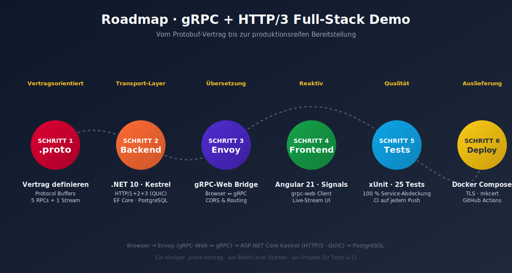

# Lernpfad — gRPC + HTTP/3 Full-Stack Demo

> Ein praxisnaher Leitfaden auf Deutsch — vom leeren Verzeichnis bis zur lauffähigen Anwendung mit `docker-compose up`.



---

## Übersicht

Diese Anleitung führt dich Schritt für Schritt durch den Aufbau des Projekts. Jeder Abschnitt entspricht einem Meilenstein auf der Roadmap-Grafik oben. Du musst die Anwendung **nicht von Grund auf neu schreiben** — der Quellcode liegt bereits im Repository. Diese Roadmap erklärt **warum** jede Schicht so aussieht, wie sie aussieht, und in welcher Reihenfolge du sie verstehen solltest.

| # | Meilenstein | Verzeichnis | Hauptdatei |
|---|---|---|---|
| 1 | Vertrag definieren | `backend/GrpcApi/Protos/` | `task.proto` |
| 2 | Backend implementieren | `backend/GrpcApi/` | `Program.cs`, `Services/TaskGrpcService.cs` |
| 3 | Envoy als Brücke | `proxy/` | `envoy.yaml` |
| 4 | Frontend anbinden | `frontend/src/app/` | `core/grpc/task.service.ts` |
| 5 | Tests schreiben | `backend/GrpcApi.Tests/` | `TaskGrpcServiceUnaryTests.cs` |
| 6 | Bereitstellen | Wurzelverzeichnis | `docker-compose.yml` |

---

## Voraussetzungen

```bash
# Pflicht
docker --version          # ≥ 24
mkcert -version           # für lokale TLS-Zertifikate

# Optional (für lokale Entwicklung ohne Docker)
dotnet --version          # ≥ 8.0
node --version            # ≥ 20
```

---

## Schritt 1 — Den Vertrag definieren (`.proto`)

**Warum zuerst?** In gRPC ist die `.proto`-Datei die **einzige Wahrheitsquelle**. Aus ihr werden sowohl der C#-Server-Stub als auch der TypeScript-Client generiert. Ein Tippfehler hier wird sofort vom Compiler beider Seiten erkannt — keine driftenden API-Specs mehr.

Schau dir die Datei an:

```proto
// backend/GrpcApi/Protos/task.proto
syntax = "proto3";
option csharp_namespace = "GrpcApi";
package tasks;

service TaskService {
  rpc GetTask     (GetTaskRequest)     returns (TaskResponse);
  rpc ListTasks   (ListTasksRequest)   returns (ListTasksResponse);
  rpc CreateTask  (CreateTaskRequest)  returns (TaskResponse);
  rpc UpdateTask  (UpdateTaskRequest)  returns (TaskResponse);
  rpc DeleteTask  (DeleteTaskRequest)  returns (DeleteTaskResponse);
  rpc StreamTasks (StreamTasksRequest) returns (stream TaskResponse);
}
```

**Drei Dinge, die hier wichtig sind:**

1. `package tasks;` ist der gRPC-Service-Name auf der Leitung — der Pfad lautet später `/tasks.TaskService/GetTask`.
2. `option csharp_namespace = "GrpcApi";` setzt den C#-Namespace und überschreibt damit den Default `Tasks`.
3. `stream TaskResponse` markiert eine **Server-Streaming-RPC** — der Server darf beliebig viele Antworten über eine offene Verbindung pushen.

> **Aha-Moment:** Im Browser kannst du gRPC nicht direkt sprechen, weil JavaScript keinen Zugriff auf HTTP/2-Trailer hat. Genau dafür existiert Envoy in Schritt 3.

---

## Schritt 2 — Das Backend (.NET 8 + Kestrel + HTTP/3)

### 2a) HTTP/3 in Kestrel aktivieren

Die entscheidende Zeile in `Program.cs`:

```csharp
builder.WebHost.ConfigureKestrel(options =>
{
    options.ListenAnyIP(5001, listenOptions =>
    {
        listenOptions.UseHttps();
        listenOptions.Protocols = HttpProtocols.Http1AndHttp2AndHttp3;
    });
});
```

`Http1AndHttp2AndHttp3` öffnet **denselben Port** für TCP (HTTP/1.1, HTTP/2) und UDP (QUIC = HTTP/3). Kestrel sendet automatisch den `Alt-Svc: h3=":5001"`-Header — der Browser merkt sich diesen Hinweis und upgradet die nächste Verbindung auf QUIC.

> **Wichtig im Container:** Du musst sowohl `5001/tcp` **als auch** `5001/udp` exposen — siehe `docker-compose.yml`. UDP ist die Pflicht für QUIC. Im Linux-Image muss `libmsquic` installiert sein (siehe `backend/Dockerfile`).

### 2b) Den gRPC-Service implementieren

`TaskGrpcService` erbt von der generierten Basisklasse `TaskService.TaskServiceBase` und überschreibt jede RPC. Beispielhaft die Streaming-Methode:

```csharp
public override async Task StreamTasks(
    StreamTasksRequest request,
    IServerStreamWriter<TaskResponse> responseStream,
    ServerCallContext context)
{
    while (!context.CancellationToken.IsCancellationRequested)
    {
        var query = db.Tasks.AsNoTracking();
        if (!string.IsNullOrEmpty(request.FilterStatus))
            query = query.Where(t => t.Status == request.FilterStatus);

        var tasks = await query.OrderByDescending(t => t.UpdatedAt)
                               .Take(10)
                               .ToListAsync(context.CancellationToken);

        foreach (var task in tasks)
        {
            context.CancellationToken.ThrowIfCancellationRequested();
            await responseStream.WriteAsync(MapToResponse(task));
        }
        await Task.Delay(TimeSpan.FromSeconds(2), context.CancellationToken);
    }
}
```

**Drei Praxis-Tipps, die in die Tests eingeflossen sind:**

- `WriteAsync(message, cancellationToken)` wird vom serverseitigen gRPC nicht unterstützt — nutze die einfache Überladung und prüfe das Token vorher manuell.
- Cast einer `IQueryable` zu `IOrderedQueryable` nach einem `.Where(...)` knallt zur Laufzeit. Filter immer vor der Sortierung.
- Eingaben validieren und mit `RpcException(new Status(StatusCode.InvalidArgument, ...))` antworten — gRPC-Statuscodes sind das Äquivalent zu HTTP-Statuscodes.

### 2c) Datenbank

EF Core + Npgsql, Auto-Migration beim Start:

```csharp
using (var scope = app.Services.CreateScope())
{
    scope.ServiceProvider.GetRequiredService<AppDbContext>().Database.Migrate();
}
```

---

## Schritt 3 — Envoy als gRPC-Web-Brücke

Browser sprechen **gRPC-Web** (Base64-kodiertes HTTP/1.1- oder HTTP/2-Frame). Der Backend spricht **natives gRPC** (binäres HTTP/2 mit Trailers). Envoy übersetzt zwischen beiden.

In `proxy/envoy.yaml` sind die zentralen Bausteine:

```yaml
http_filters:
  - name: envoy.filters.http.grpc_web      # ← die Magie
  - name: envoy.filters.http.cors
  - name: envoy.filters.http.router

clusters:
  - name: grpc_api_service
    typed_extension_protocol_options:
      envoy.extensions.upstreams.http.v3.HttpProtocolOptions:
        explicit_http_config:
          http2_protocol_options: {}      # ← Upstream zwingend HTTP/2
```

> **Stolperfalle:** Vergiss die `http2_protocol_options` nicht. Envoy spräche sonst HTTP/1.1 mit dem Backend, und gRPC würde fehlschlagen.

---

## Schritt 4 — Angular-Frontend

### 4a) TypeScript-Stubs aus `.proto` erzeugen

```bash
cd frontend
npm run proto:gen     # ruft scripts/gen-proto.sh auf
```

Das Skript verwendet `protoc` mit dem `grpc-web`-Plugin und legt die generierten Dateien unter `src/app/core/grpc/generated/` ab.

### 4b) Service-Schicht mit Signals

`task.service.ts` kapselt den Callback-basierten gRPC-Web-Client in **Observables** (für Unary-Calls) und **Signals** (für den Live-Stream):

```typescript
readonly streamedTasks = signal<Task[]>([]);

startStream(filterStatus = ''): void {
  const stream = this.client.streamTasks(req, {});
  stream.on('data', (response) => {
    this.streamedTasks.update(tasks =>
      [this.mapTask(response), ...tasks].slice(0, 50));
  });
}
```

Die Signal-API macht jegliches RxJS für die UI überflüssig — die Komponente liest einfach `taskService.streamedTasks()` und Angular rendert reaktiv neu.

### 4c) UI-Komponenten

- `task-list/`: klassische CRUD-Seite mit Material-Design.
- `task-stream/`: Live-Feed mit pulsierendem **LIVE**-Indikator.

---

## Schritt 5 — Tests (xUnit + InMemory-DB)

Die Test-Suite befindet sich in `backend/GrpcApi.Tests/`. Sie bedeckt **alle 6 RPC-Methoden** und das Kernverhalten der Datenbank.

### Schlüsselbausteine

| Helfer | Aufgabe |
|---|---|
| `TestDb.Create()` | Liefert einen frischen `AppDbContext` mit eindeutigem In-Memory-Namen — **null Kreuzkontamination** zwischen Tests. |
| `TestServerCallContext` | Minimaler `ServerCallContext` ohne echten Kestrel — direkt für Unit-Tests. |
| `CapturingStreamWriter<T>` | Sammelt jede `WriteAsync`-Nachricht für Assertions im Streaming-Test. |

### Tests ausführen

```bash
cd backend
dotnet test GrpcApi.Tests/GrpcApi.Tests.csproj -c Release \
    --collect:"XPlat Code Coverage"
```

Erwartetes Ergebnis: **25 / 25 grün** in unter einer Sekunde (siehe [`docs/test-results.md`](../test-results.md)).

> **Tipp:** Für `dotnet restore` immer `DOTNET_SYSTEM_NET_DISABLEIPV6=1` setzen — sonst hängt NuGet auf manchen Systemen minutenlang.

---

## Schritt 6 — Bereitstellung mit Docker Compose

### 6a) TLS-Zertifikate erzeugen

```bash
bash certs/generate.sh
```

`mkcert` installiert eine lokale Root-CA und stellt ein Zertifikat für `localhost` aus — der Browser vertraut ihm sofort.

### 6b) Alles starten

```bash
docker compose up --build
```

Vier Container starten in dieser Reihenfolge:

```
postgres  ──►  api (HTTP/3)  ──►  envoy (8080)  ──►  frontend (4200)
```

### 6c) HTTP/3 verifizieren

1. Chrome öffnen: <https://localhost:5001/healthz>
2. DevTools → **Network** → Spalte **Protocol** → erste Anfrage zeigt `h2`, jede weitere `h3`.
3. Im Response-Header siehst du `alt-svc: h3=":5001"`.

### 6d) Streaming verifizieren

1. <http://localhost:4200/stream> öffnen.
2. **Start Stream** klicken — der Live-Indikator pulsiert.
3. In einem zweiten Tab über die Task-Liste eine neue Aufgabe anlegen — sie erscheint binnen 2 Sekunden im Stream.

---

## Zusammenfassung — was du gelernt hast

| Konzept | Wo im Code |
|---|---|
| Vertragsorientierte API mit Protobuf | `Protos/task.proto` |
| HTTP/3-Konfiguration in Kestrel | `Program.cs` (Z. 14–22) |
| Server-Streaming-RPC | `Services/TaskGrpcService.cs` (`StreamTasks`) |
| gRPC-Statuscodes als Fehlerprotokoll | überall in `TaskGrpcService.cs` |
| gRPC-Web-Übersetzung | `proxy/envoy.yaml` |
| Reaktive UI mit Signals statt RxJS | `core/grpc/task.service.ts` |
| Unit-Tests ohne echten gRPC-Host | `GrpcApi.Tests/Helpers/` |
| Reproduzierbare Bereitstellung | `docker-compose.yml` |

**Nächste sinnvolle Schritte für dein Portfolio:**

- JWT-Authentifizierung scharf schalten (`AddAuthentication().AddJwtBearer(...)`).
- Bidirektionales Streaming (Chat-RPC) ergänzen.
- Lasttest mit `ghz` durchführen und Ergebnisse in den README aufnehmen.
- OpenTelemetry-Tracing aktivieren (`Grpc.Net.Client` ist von Haus aus instrumentiert).

Viel Erfolg!
